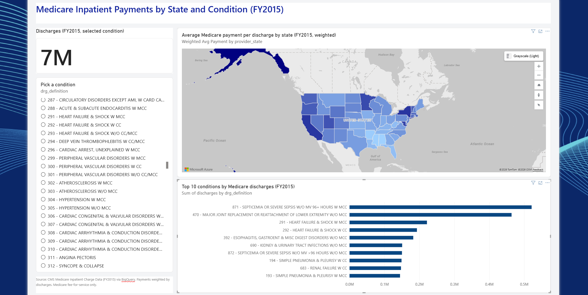
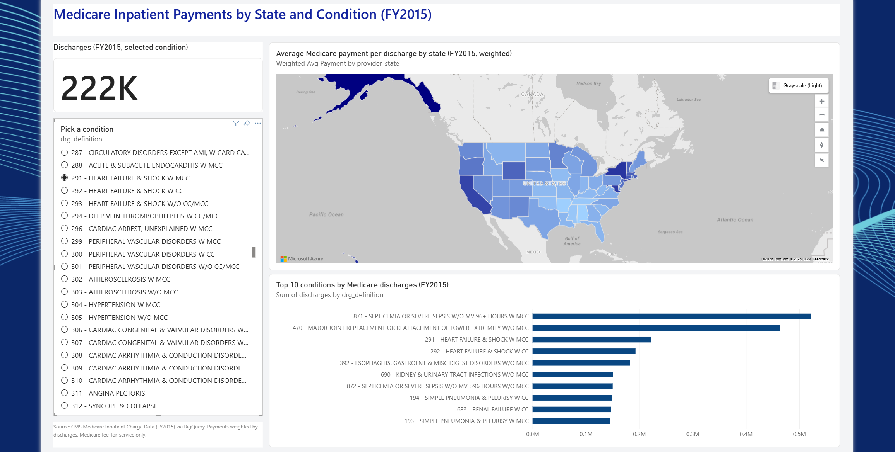

# CMS Medicare Inpatient Analysis (SQL + Power BI)

Analysis of CMS Medicare inpatient charge data in Google BigQuery, with a Power BI report on payments by state and condition.

- **Question:** Where and for which conditions do Medicare inpatient payments differ most?
- **Data:** CMS Medicare Inpatient Charge Data (FY2015), via BigQuery public datasets (`bigquery-public-data.cms_medicare`), 201,876 rows
- **Tools:** SQL (BigQuery), Power BI (DAX)

## Findings
- In FY2015, simple average Medicare inpatient payments per discharge were highest in DC ($19,138), Alaska ($19,126), and Hawaii ($18,080).
- The most common conditions by discharges were sepsis (~521,000), major joint replacement (~464,000), and heart failure with MCC (~222,000).
- For heart failure & shock with MCC (DRG 291), the highest-paid Texas hospital averaged about $42,000 above the Texas average.
- Among the four states checked (AK, NY, MD, CA), Alaska had the highest weighted average payment per discharge for DRG 291 ($16,268), ahead of New York ($14,337), Maryland ($14,102), and California ($13,794). Alaska's figure rests on only 160 discharges, compared with more than 11,000 in New York and 16,000 in California.

## Files
- `sql/`: queries 01-06 (state averages, top conditions, hospital vs state average with a CTE and join, Power BI export, and verification of report values)
- `state_drg_summary.csv`: query 05 results used in Power BI
- `cms_medicare_report.pbix`: Power BI report

## Notes
- Medicare fee-for-service only, not all U.S. hospital stays.
- FY2015 data.
- Query 01 is a simple average; query 05 and the Power BI report are weighted by discharges.
- Report values were checked against BigQuery (query 06).

